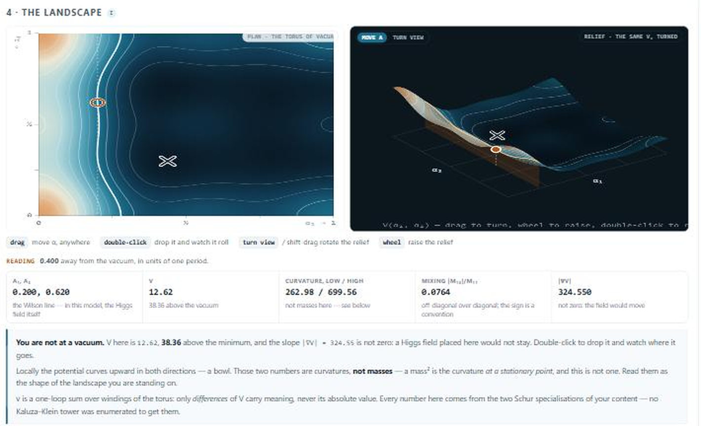

# 🧭 GHU tools — SU(4) gauge–Higgs on T²/Z₂

**▶️ [karlesmarin.github.io/ghu-explorer](https://karlesmarin.github.io/ghu-explorer/)**

[](https://karlesmarin.github.io/ghu-explorer/calculator.html)

Three self-contained HTML pages. Open one; no server, no install, no network. Nothing you type
leaves the page.

| | | |
|---|---|---|
| 1 | [**Selection rule**](https://karlesmarin.github.io/ghu-explorer/) `index.html` | which α-domain you may legally search |
| 2 | [**Model calculator**](https://karlesmarin.github.io/ghu-explorer/calculator.html) `calculator.html` | a matter content in, the Higgs out |
| 3 | [**η-meter**](https://karlesmarin.github.io/ghu-explorer/predictor.html) `predictor.html` | what the boundary sign does, in closed form — then the field released on the potential |

## 🧭 1 · Selection rule

If you compute a one-loop Wilson-line potential on T²/Z₂, you probably halve the search region in
α₂. For every representation able to host a Standard-Model quark generation that halving is
invalid, and nothing warns you — a restricted minimiser returns a boundary point that looks like a
vacuum. This page shows you, rather than telling you.

Pick a representation and the potential redraws over the full period-2 torus — three ways,
whichever makes the landscape clearest: a **rotatable 3D torus**, a **surface** with the α₂=½ cut
drawn as a ridge, or a **heat map** from above. The twist imbalance δ(m) shows which comb of teeth
vanishes, the Fourier panel shows the seats that stay identically empty, and the verdict says which
region you may legally search.

**The honest part.** Everything computed from Dynkin labels is a *theorem*, and only for SU(4) on
T²/Z₂. For any other spectrum there is no theorem, so the bottom panel *measures* the two pairings
from an (m,q) table you paste. Outputs are labelled `theorem`, `measured` or `conjecture`.

## 🔬 2 · Model calculator

Type a matter content — **any** content, not the handful whose Kaluza–Klein spectra somebody has
written out — and read the one-loop potential over the torus of Wilson lines, its vacuum, the Higgs
mass matrix there, the electroweak verdict, which multiplets are blind to the boundary sign, and
whether the embedding has a coset sector at all. Mode counts come from the Young diagram through
Part IV's closed form; η acts on the coset half alone, which is Part V's theorem.

**The landscape is a control, not a picture.** Drag any of the three panels — the plan, the relief,
the cut — and a reading bar reports **at your cursor**, not only at the vacuum, with a paragraph
that says what those numbers mean *there* and refuses to call a curvature a mass away from a
minimum. Double-click drops the field and it rolls downhill; the relief turns under the mouse.
`▶ show me` runs a 30-second guided tour. Deep links carry a content:
`calculator.html#c=4,0,0*3;1,0,1*-1` — irrep `*` multiplicity, negative for the gauge sector,
optional `:−1` for η, and `#c=ahmn` loads AHMN's model.

**The anchor travels with the instrument.** At load the page recomputes AHMN
[arXiv:2312.08608](https://arxiv.org/abs/2312.08608) and shows a chip with their published vacuum
(0.438, 0.299) and mass ratio. If the port ever drifts, the page says so itself, on itself.

## 🧮 3 · η-meter

It opens with the answer in one sentence — *flip η and this Higgs gets lighter, by this much* —
computed from **one integer** with no winding summed, next to the brute-force Hessian that confirms
it. The machinery is folded below for whoever wants it: the box, the moments, the inversion, the
prediction, blindness, and a search.

At the symmetric point the **entire** η-dependence of the Higgs mass matrix is one number:

```
ΔH₁₁ = −2(2π)² L₁ · M₂/8      ΔH₂₂ = −2(2π)² L₂ · M₂/8      ΔH₁₂ = 0 exactly
L₁ = Σ_{k₂ odd}|k|⁻⁶k₁² = 0.7249      L₂ = Σ_{k₂ odd}|k|⁻⁶k₂² = 2.6530
M₂ = M₀·(C_p + C_q + C_r)/3           C_k = k(k+2)
```

so a model's η-response is arithmetic: any content with `M₂ = 0` is invisible to η at this order
however large it is, and the sign of `M₂` says which way the boundary sign pushes the Higgs. The
page checks itself against the winding sum every time you change the content, and the build checks
it on five contents (agreement better than 0.02 %, which is the Hessian's finite difference), with
the blind control and its anti-vacuity control.

Three more things it does:

- **Search.** Given your multiplets it finds multiplicities and boundary signs for which the coset
  index cancels **identically**, in exact integers: a content of multiplets that each see η and
  which as a whole cannot. `1×(4,0,0)` with η=+1 and `1×(0,0,4)` with η=−1 is one.
- **Release the field.** Many configurations dropped at random and integrated with friction on the
  same V. Where they end up is the basin structure. This is the zero mode relaxing — one α for all
  of space — **not** a lattice field simulation, and it says so.
- **The atlas.** 120 landscapes side by side. In η-difference mode every blind multiplet goes blank
  — Theorem 1 as a picture, a hundred times at once — and two multiplets with the same box draw
  literally the same image, which is Part IV seen without reading a number.

## 🔭 The compression — Part IV

Part IV shows the whole twist imbalance collapses to **three integers**. For a representation
`(a,b,c)` — the four-row partition `λ = (a+b+c, b+c, c, 0)` — its shadow character on the
reflection element `{1,−1,t,1/t}` is

```
s_λ(1,−1,t,1/t)  =  0    or    ± χ_p χ_q χ_r,
```

a product of exactly three SU(2) characters whose indices `(p,q,r)` are read off the 2-quotient of
`λ`. It carries the chip `verified`, not `theorem`: checked against the enumerated δ(m) on all 119
representations here, and in the paper against the bialternant on all **3060** partitions with four
parts ≤ 14 and all **4845** with parts ≤ 16, where it is stated as an *Observation* and **not yet
proved**.

The compression is also **invertible**: three moments give the box back,
`e₁ = 3M₂/M₀`, `e₂ = (15/4)(M₄/M₀) − (3/4)e₁² + e₁`, `e₃ = M₀² − 1 − e₁ − e₂`, with
`{C_p,C_q,C_r}` the roots of `x³ − e₁x² + e₂x − e₃`. Tool 3 uses it to ask a whole model whether it
behaves like a single multiplet.

## 🔧 Build

```
python build.py          # 1 · Selection rule    -> index.html
python build_calc.py     # 2 · Model calculator  -> calculator.html
python build_predict.py  # 3 · η-meter           -> predictor.html
```

Each build inlines its data into its shell **and then runs the page's own mathematics headlessly in
node against numbers produced outside the page** — the papers, the Python engine of Part V, or the
character itself. A browser tool that quietly disagreed with the paper it advertises would be worse
than no tool, so the build fails if it does. `build_predict.py` injects the engine and the panel
code extracted from `src/calc_shell.html`, so pages 2 and 3 cannot drift apart.

What the tests check, beyond building: the nine period-1 residuals and the notch predicate on all
119 representations · Part IV's closed form against the enumerated δ(m) · AHMN's published vacuum
and mass matrix · V and the full Hessian against the Part V Python engine at four points, **away
from the vacuum as well** · that ζ·χ_p·χ_q·χ_r really is the coset index on every catalogued
multiplet, in both directions · that η cannot move a blind content and does move a sighted one ·
the closed-form moments and their inversion on all 104 sighted rows · the η-splitting prediction
against the brute force · and the conventions the panels rest on, measured rather than assumed
(α₂ has period 1, **α₁ has period 2**, both reflections exact, and [0,1]² is still a fundamental
domain), each with the control that makes it capable of failing.

## 🎯 The results behind them

Advancing the Wilson line by one period is, up to a Weyl reflection, multiplication by the central
element −**1** ∈ Z(SU(4)). A representation answers with the scalar (−1)^(a+2b+3c), so the
harmonics carrying the opposite sign are identically absent — not suppressed, absent. That is
Part III. Part IV compresses what survives to three integers. Part V says which multiplets the
boundary condition cannot touch at all, and counts them; that classification is machine-checked in
Lean 4.

## 📚 The series

- **Part I — *Anomaly- and Tadpole-Compatible Fermion Completion of 6D SU(4) GHU***
  → [github.com/karlesmarin/ghu-su4-completion](https://github.com/karlesmarin/ghu-su4-completion) · [Zenodo 10.5281/zenodo.21432625](https://doi.org/10.5281/zenodo.21432625)
- **Part II — *Three Gates to a Quark Generation***
  → [github.com/karlesmarin/su4-sm-cell-criterion](https://github.com/karlesmarin/su4-sm-cell-criterion) · [Zenodo 10.5281/zenodo.21432627](https://doi.org/10.5281/zenodo.21432627)
- **Part III — *A Centre-Charge Selection Rule for the Wilson-Line Potential*** (tool 1)
  → [github.com/karlesmarin/centre-parity-selection](https://github.com/karlesmarin/centre-parity-selection) · [Zenodo 10.5281/zenodo.21438226](https://doi.org/10.5281/zenodo.21438226)
- **Part IV — *Schur Functions at (1,−1,t,t⁻¹)*** (tools 2 and 3)
  → [github.com/karlesmarin/schur-nonidentity-o4](https://github.com/karlesmarin/schur-nonidentity-o4) · [Zenodo 10.5281/zenodo.21463000](https://doi.org/10.5281/zenodo.21463000)
- **Part V — *What the Higgs Potential Cannot See*** (tools 2 and 3)
  → [github.com/karlesmarin/higgs-blind-class](https://github.com/karlesmarin/higgs-blind-class) · [Zenodo 10.5281/zenodo.21727095](https://doi.org/10.5281/zenodo.21727095)

---

Carles Marín · `karlesmarin@gmail.com` · Claude (Anthropic) as AI research assistant · Apache 2.0
