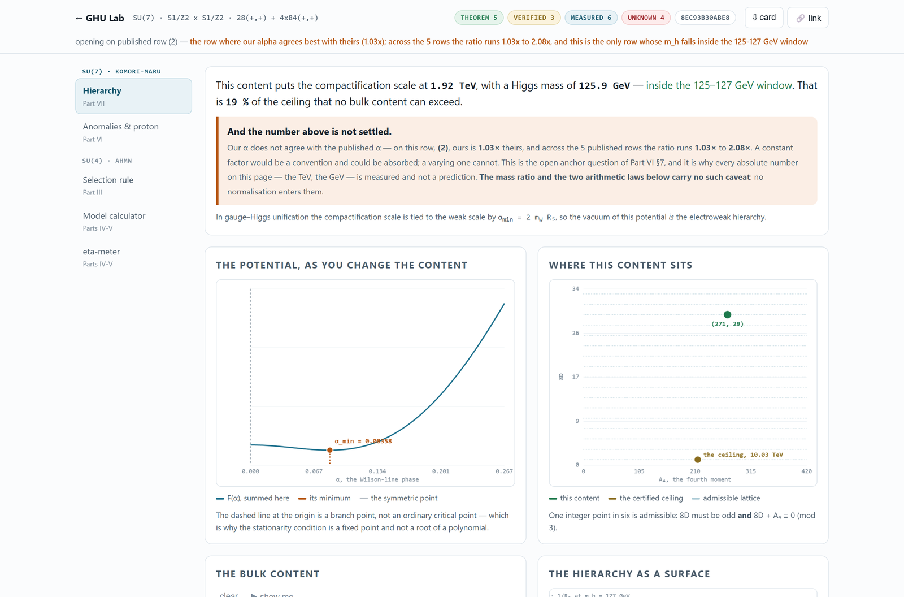

# 🧭 GHU Lab — an instrument for gauge–Higgs unification

**▶️ [karlesmarin.github.io/ghu-explorer](https://karlesmarin.github.io/ghu-explorer/)**

[](https://karlesmarin.github.io/ghu-explorer/app/)

One bulk model, several computations over it, and **every output carrying what is known about
it** — `theorem`, `verified`, `measured` or `unknown`. One HTML file. Open it; no server, no
install, no network. Nothing you type leaves the page, and it works from `file://`.

This repository is the published home of a seven-part series on gauge–Higgs unification. It
carries three things:

| | |
|---|---|
| 🔬 [**the instrument**](https://karlesmarin.github.io/ghu-explorer/app/) | eleven sections, three models, `app/index.html` |
| 📄 [**a page per paper**](https://karlesmarin.github.io/ghu-explorer/papers/) | what each one claims, what it does not |
| 🗄️ [**the July 2026 tools**](https://karlesmarin.github.io/ghu-explorer/tools-2026-07/index.html) | the earlier three pages, carried over unchanged |

## 🔬 The instrument

Eleven sections over three models — SU(7) on S¹/Z₂ × S¹/Z₂, SU(4) on T²/Z₂, and
Haba–Yamashita's 5D SU(3) on S¹/Z₂. Change a matter content once and every section of its
family recomputes.

| | | |
|---|---|---|
| 1 | **Hierarchy** · Part VII | the compactification scale, the Higgs mass, and how far the content sits below the ceiling no bulk content can exceed |
| — | **Atlas** · Part VII | every content of at most five multiplets — 1 286 of them — with its potential drawn on one canvas, sorted by α_min and coloured by verdict: one green tile in the Higgs window, and it is their row (2); click any tile to load it |
| 2 | **Same potential?** · Part VII | hold two contents up to Theorem 3: same five coordinates ⟺ identically the same one-loop potential — with the kernel relations as buttons and both potentials drawn |
| 3 | **Anomalies & proton** · Part VI | what each multiplet contributes to the bill in eighths, the ladder of odd eighths, and what the escape costs |
| 4 | **Escape from proton decay** · Part VI | the escape constructed: type a brane content — rungs, X_Q, q_φ — and get the six channels, the 64-triple rung cube in 3-D, the fourteen assignments, the selection rule and the bill |
| 5 | **Screen a table** · Parts VI–VII | three tests on someone else's published row, none recomputing their model: the mod-6 law on two integers, the K invariant (what g₄ the row implies), and the arithmetic comb the KK scale must sit on |
| 6 | **Collider** · Part VII | which state a dijet search bounds: the wide coloron with no free parameter (√2·g_s saturated, Γ/M = 2α_s), the whole tower as one form factor whose poles are the resonances, the distortion drawn as a draggable relief over (M_jj, χ) — the measurement's own binning — and the ratio table at the recast's own bins, at the model's scale or any 1/R₅ you type |
| 7 | **Selection rule** · Parts II–III | which α-domain you may legally search — and Part II's three gates: which (a,b,c) can hold a quark generation, with the closed count N = (b+1)(a+c+1)/2 and the minimality of the 60 recovered live |
| 8 | **Model calculator** · Parts IV–V | a matter content in, the Higgs out |
| 9 | **η-meter** · Parts IV–V | what the boundary sign does, in closed form — then the field released on the potential |
| 10 | **Five dimensions** · Haba–Yamashita 2004 | their own 5D SU(3) model, with the thing their paper calls the hard part and leaves undone — the vacuum — located in the browser; six numbers in, α_min and the KK spectrum out, everything in units of 1/R |

**What you can find with it.** Type a content and the hierarchy section answers in one sentence
— *this content puts the compactification scale here, with this Higgs mass* — and then tells you
what is wrong with that sentence: our α does not agree with the published α, by a factor that
varies from row to row rather than staying constant, so every absolute TeV and GeV on the page is
a **measurement** and not a prediction, while the mass ratio and the arithmetic laws beside it
carry no such caveat. The instrument says this on itself, at the top, before you read a number.

The anomalies section prices every multiplet's contribution to `8D` as signed bars and draws the
ladder of odd eighths with `8D = 0` marked as **the rung that does not exist** — the odd-eighths
theorem as a picture. Then it runs the proton-decay escape on each published row, reporting what
it costs and whether the row can pay, and asks the same question of the **whole SU(7) lattice**
rather than of five rows. Its wedge panel then holds the headline to a harder standard: reweight
every 28 and every 84 and the verdict "row (2) is the unique row" survives on a drawn **region**
of repair space — every repair the anchor programme ever fitted lands inside, and the largest
repair the α column asks for turns out to be identically invisible to it.

The escape section then constructs the escape itself, in exact rational arithmetic: type a brane
content and the six anomaly channels, the fourteen assignments and the selection rule recompute.
Its rung cube draws Part VI's central obstruction as geometry — the 64 rung triples in 3-D, with
the family-universal diagonal where protection dies — and states a fact the enumeration pins:
every assignment that protects the proton can also cancel all six channels, so protection never
costs an anomaly.

The same-potential section opens on Part VII's Theorem 3 already earning its keep: the model
beside a *different* multiset — its canonical representative on five types — with all five
coordinates equal, the dashed potential riding exactly on the solid one, and the three kernel
relations as buttons that rewrite one content into the other without moving a single invariant.
Degenerate contents are in print and were called an accident; the kernel says they are a
subspace.

The screen section runs three tests on a published row without recomputing its model. On the
five rows of the paper this series audits, the K invariant — the same 2.2456·g₄ for every row of
every content, blind to the normalisation — already speaks: three rows are consistent near
g₄ ≈ 0.6, one would need g₄ = 1.87, and one is not even at a minimum of its own content's
potential. The comb card puts a candidate KK resonance on the arithmetic teeth, each rung cut at
its own certified ceiling — counting the teeth beyond the ceilings, every mass would land
somewhere, and a screen that cannot fail screens nothing.

The collider section turns the bound into an object: the one coloured state a dijet search can
see, with **no free parameter anywhere** — coupling saturated at √2·g_s by the localisation
itself, width fixed at 2α_s — so a recast needs no coupling scan. The whole tower collapses into
one analytic form factor whose poles *are* the resonances, drawn as a draggable relief over
(M_jj, χ), the plane CMS bins its angular measurement in; a ratio table at the recast's own bins
comes out at the model's scale or at any 1/R₅ you type. The Δχ² verdict at the per-rung teeth is
quoted from the published record — 12.0 at the top tooth against a threshold of 3.84, the escape
branch beyond a thousand — and the margin behind it is the integrality of 8D: halve the quantum
and the conclusion changes sign.

The five-dimensions section is the first with no stake in the series: Haba & Yamashita's 2004
model, exactly as published, with its vacuum located — their summary calls analysing the vacuum
structure the hard part, and their paper never computes a minimum. Type six bulk counts and the
page returns α_min (checked against direct minimisation on the same render), the KK spectrum at
the vacuum, and three one-press facts: pure gauge never breaks the symmetry (D = −9), marginality
is three multiplets away (8D = 0 exactly), and the potential is blind to (ΔN_f, ΔN_s) = (1, 2) —
Part V's blind class in a second model. In this whole 5D class 8D is even: the odd rung the SU(7)
ceiling stands on needs the sixth dimension.

The η-meter opens with the answer in one sentence — *flip η and this Higgs gets lighter, by this
much* — computed from **one integer** with no winding summed, next to the brute-force Hessian
that confirms it. Its atlas draws 119 landscapes at once; in η-difference mode every blind
multiplet goes blank, which is Part V's theorem seen without reading a number.

**The honest part.** Every number is computed in your browser from the term tables. Nothing is
precomputed, and nothing is asserted without a label saying what kind of claim it is. A
`measured` chip means exactly that, and it inherits the anchor caveat above.

## 🗄️ The July 2026 tools

Five published Zenodo records link to the host these pages were served from. A URL in a published
record is not ours to break, so the three earlier pages are carried over **byte for byte** and
keep working:

- [`/tools-2026-07/index.html`](https://karlesmarin.github.io/ghu-explorer/tools-2026-07/index.html) — Orbifold Explorer, the page previously served as `/index.html`
- [`/tools-2026-07/calculator.html`](https://karlesmarin.github.io/ghu-explorer/tools-2026-07/calculator.html) — Orbifold Model Calculator
- [`/tools-2026-07/predictor.html`](https://karlesmarin.github.io/ghu-explorer/tools-2026-07/predictor.html) — η-meter

`/calculator.html` and `/predictor.html` also still answer at the root, where the records point
them. Their builders live here and write into `tools-2026-07/`; running one reproduces the
carried page byte for byte, which is the check that the frozen page is still what its source
makes.

```
python build.py          # Orbifold Explorer   -> tools-2026-07/index.html
python build_calc.py     # Model calculator    -> tools-2026-07/calculator.html
python build_predict.py  # η-meter             -> tools-2026-07/predictor.html
```

Each build inlines its data into its shell **and then runs the page's own mathematics headlessly
in node against numbers produced outside the page** — the papers, the Python engine of Part V, or
the character itself. A browser tool that quietly disagreed with the paper it advertises would be
worse than no tool, so the build fails if it does.

## 🎯 The results behind it

Advancing the Wilson line by one period is, up to a Weyl reflection, multiplication by the central
element −**1** ∈ Z(SU(4)). A representation answers with the scalar (−1)^(a+2b+3c), so the
harmonics carrying the opposite sign are identically absent — not suppressed, absent. That is
Part III. Part IV compresses what survives to three integers — the shadow character
`s_λ(1,−1,t,1/t)` is `0` or `± χ_p χ_q χ_r`, a product of exactly three SU(2) characters read off
the 2-quotient of `λ`. Part V says which multiplets the boundary condition cannot touch at all,
and counts them; that classification is machine-checked in Lean 4. Parts VI and VII move to
SU(7): the anomaly and proton-decay bill, and the compactification scale.

## 📚 The series

- **Part I — *Anomaly- and Tadpole-Compatible Fermion Completion of 6D SU(4) GHU***
  → [github.com/karlesmarin/ghu-su4-completion](https://github.com/karlesmarin/ghu-su4-completion) · [Zenodo 10.5281/zenodo.21432625](https://doi.org/10.5281/zenodo.21432625)
- **Part II — *Three Gates to a Quark Generation***
  → [github.com/karlesmarin/su4-sm-cell-criterion](https://github.com/karlesmarin/su4-sm-cell-criterion) · [Zenodo 10.5281/zenodo.21432627](https://doi.org/10.5281/zenodo.21432627)
- **Part III — *A Centre-Charge Selection Rule for the Wilson-Line Potential***
  → [github.com/karlesmarin/centre-parity-selection](https://github.com/karlesmarin/centre-parity-selection) · [Zenodo 10.5281/zenodo.21438226](https://doi.org/10.5281/zenodo.21438226)
- **Part IV — *Schur Functions at (1,−1,t,t⁻¹)***
  → [github.com/karlesmarin/schur-nonidentity-o4](https://github.com/karlesmarin/schur-nonidentity-o4) · [Zenodo 10.5281/zenodo.21463000](https://doi.org/10.5281/zenodo.21463000)
- **Part V — *What the Higgs Potential Cannot See***
  → [github.com/karlesmarin/higgs-blind-class](https://github.com/karlesmarin/higgs-blind-class) · [Zenodo 10.5281/zenodo.21727094](https://doi.org/10.5281/zenodo.21727094)
- **Part VI — *Proton Decay in SU(7) Grand Gauge-Higgs Unification: An Obstruction, Its Minimal Escapes, and the One Row of Their Table 1 That Can Pay for Them***
  → [github.com/karlesmarin/su7-proton-row](https://github.com/karlesmarin/su7-proton-row) · [Zenodo 10.5281/zenodo.22033302](https://doi.org/10.5281/zenodo.22033302)
- **Part VII — *An Upper Bound on the Compactification Scale of SU(7) Grand Gauge-Higgs Unification, and the Dijet Angular Distribution That Tests It***
  → [github.com/karlesmarin/su7-compactification-bound](https://github.com/karlesmarin/su7-compactification-bound) · [Zenodo 10.5281/zenodo.22087251](https://doi.org/10.5281/zenodo.22087251)

Each paper has a page here saying what it claims and what it does not:
[karlesmarin.github.io/ghu-explorer/papers/](https://karlesmarin.github.io/ghu-explorer/papers/).
What changed and when, including anything that touched a published record, is in
[changes](https://karlesmarin.github.io/ghu-explorer/changes/).

---

Carles Marín · `karlesmarin@gmail.com` · Claude (Anthropic) as AI research assistant · Apache 2.0
