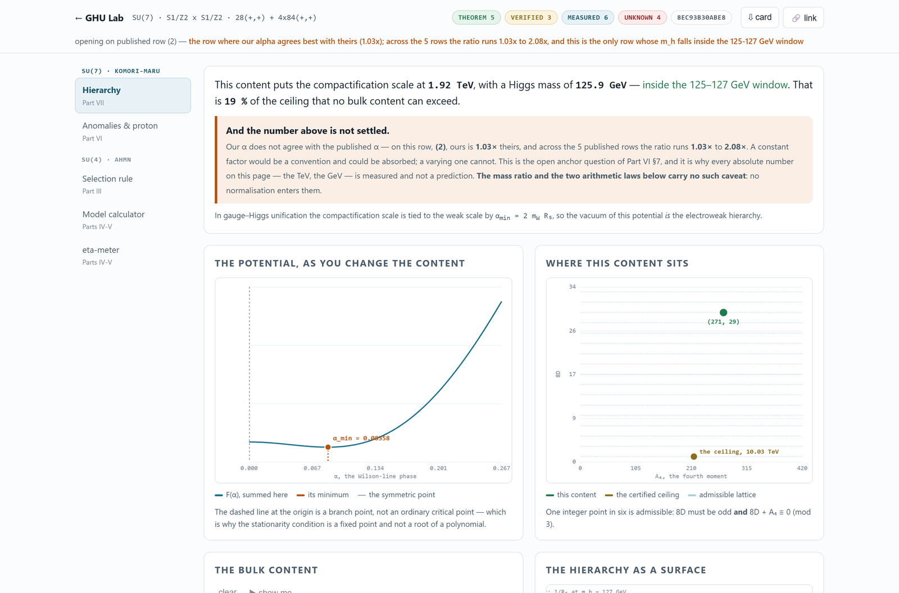
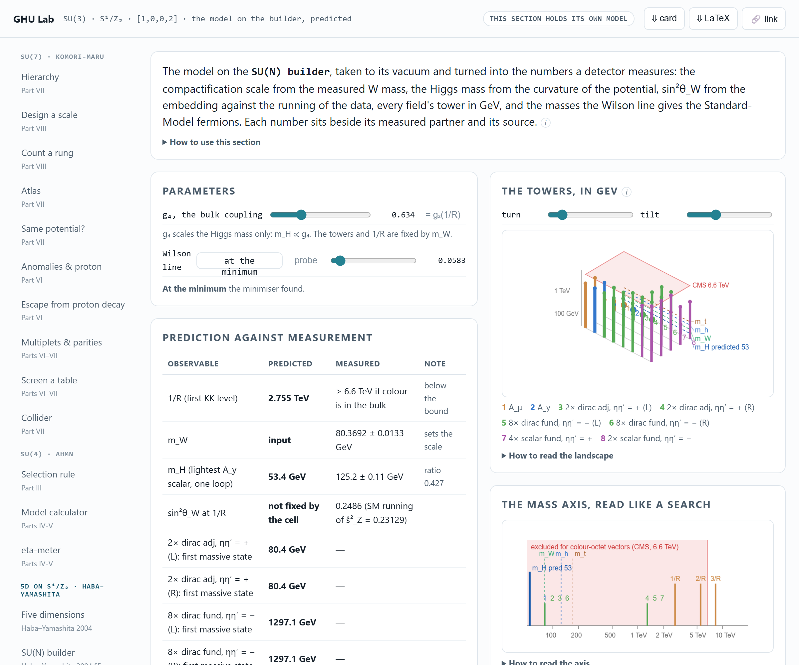

# 🧭 GHU Lab — an instrument for gauge–Higgs unification

**▶️ [karlesmarin.github.io/ghu-explorer](https://karlesmarin.github.io/ghu-explorer/)**

[](https://karlesmarin.github.io/ghu-explorer/app/)

[](https://karlesmarin.github.io/ghu-explorer/app/#s=predict)

*The **Simulator** on the model of Haba–Hosotani–Kawamura–Yamashita (hep-ph/0401183, Fig. 1): their
published vacuum a = 0.058 comes out as 0.0583, the measured W mass turns it into 1/R = 2.755 TeV,
and the curvature of the potential gives a Higgs of 53.4 GeV against the measured 125.20 — the
model reproduced and falsified on the same screen, with every source named.*

One bulk model, several computations over it, and **every output carrying what is known about
it** — `theorem`, `verified`, `measured` or `unknown`. One HTML file. Open it; no server, no
install or network for the browser calculations and stored benchmarks. Optional PhaseTracer and HiggsTools runs send the chosen numerical scenario to your local engine; no remote service is used.

This repository is the published home of a **nine-part series** on gauge–Higgs unification —
ten Zenodo records, Part IX having gone out as two. It carries four things:

| | |
|---|---|
| 🔬 [**the instrument**](https://karlesmarin.github.io/ghu-explorer/app/) | twenty-nine panels over three models, with tools and research diagnostics, `app/index.html` |
| 📄 [**a page per paper**](https://karlesmarin.github.io/ghu-explorer/papers/) | what each one claims, what it does not |
| 🗄️ [**the July 2026 tools**](https://karlesmarin.github.io/ghu-explorer/tools-2026-07/index.html) | the earlier three pages, carried over unchanged |
| 🔧 [**the source**](https://github.com/karlesmarin/ghu-lab) | `karlesmarin/ghu-lab` — the tree this page is built from: kernel, modules, sections, 64 harnesses and the browser gates |

<a id="october-2026-research-experiments"></a>

## Research experiments added in October 2026

**Nine research additions inside the existing 29 panels.** The section links below open the
public app; the route names tell you which experiment to select inside that panel. These cover
separate flat, warped, neutrino and scalar scenarios. Each calculation states its own action,
inputs and limits; sharing the instrument does not make them a combined GHU fit.

| Experiment · where to open it | What you change and what it computes | First comparison and scope |
|---|---|---|
| **Maru–Nago SU(6): Type 2 / Type 3 families** · [Paper models](https://karlesmarin.github.io/ghu-explorer/app/index.html#s=papers) → **Maru–Nago SU(6)** | Vary the Type 3 generation count k₃, adjoint Dirac copies and Fourier cutoff. Read the Wilson potential, a magnified view of its minimum, the published reference and a convergence table. **Load into the SU(N) builder** transfers the supported bulk potential. | Start with k₃=3, N_ad=5 and compare 10 with 1000 Fourier terms. The comparison exposes truncation sensitivity; it does not certify the Higgs mass, the lifting of adjoint exotic zero modes or complete flavour consistency. |
| **Warped SU(6): differential running and UV brane terms** · [Brane kinetic terms](https://karlesmarin.github.io/ghu-explorer/app/index.html#s=blkt) → **Warped SU(6)** | Switch the C1/C2 matter assignment; vary IR/UV scales and the two boundary-coupling differences. Plot α₂⁻¹−α₁⁻¹ and α₃⁻¹−α₁⁻¹, read the required Δλ values and residuals, and inspect a separate UV localization/mass probe. | Compare C1 with C2, then set the chosen Δλ values to the required ones. This is one-loop differential running with approximate IR matching. The NDA reference is a scale estimate, and the localization probe is separate from the C1/C2 spectrum. |
| **Three active flavours: a rank 2 or rank 3 ring extension** · [Simulator](https://karlesmarin.github.io/ghu-explorer/app/index.html#s=predict) → **Neutrino ring** → **Three active flavours** | Choose normal/inverted ordering, the lightest mass, PMNS angles and phases, and active-deficit directions. Three sterile copies reconstruct Yukawa columns, the light mass matrix and 18 heavy-pair flavour weights. Read Σmν, mβ, mββ, J_CP, a flavour map and vacuum oscillation curves. | Compare the NuFIT 6.1 normal/inverted presets and vary δ. Masses and PMNS orientation are supplied inputs, not predictions. Separate NuFIT ranges do not define a joint likelihood; the oscillation plot uses the unitary vacuum limit. |
| **Computed Majoron decay channels** · [Simulator](https://karlesmarin.github.io/ghu-explorer/app/index.html#s=predict) → **Neutrino ring** → **Decays** | Enable the computed Majoron widths, choose a heavy pair and vary the scalar VEV ratios. The physical, canonically normalized Majoron direction gives light and heavy cascade widths that enter the scenario lifetime and SS/OS diagnostic; overlap warnings identify where isolated-pair treatment fails. | Compare channels disabled/enabled at the same fermion mass matrix. The reference leaves them disabled; that setting is not a claim that they are absent. The calculation is at leading Majorana order; the scalar vacuum and additional radial channels remain outside its scope. [Equations and independent checks](https://github.com/karlesmarin/ghu-lab/blob/main/docs/neutrino-majoron.md). |
| **RS anomaly flow and baryon current** · [Anomalies & proton](https://karlesmarin.github.io/ghu-explorer/app/index.html#s=anomalies) → **RS anomaly flow** | Vary the Wilson angle, warp factor, selected Z mode and quark/lepton generation counts. Normalized gauge profiles give the UV/IR anomaly factors and their sum, the mode masses and a neutral baryon-current matrix. Compare normalization quadratures and the paper's fixed finite-KK reference table. | Remove one lepton generation, then restore it. Gauge-anomaly cancellation and baryon-current violation are distinct outputs. The published finite fermion-KK sums are reference data, and no proton lifetime or baryogenesis yield is inferred. |
| **Finite-temperature GHU: Wilson potential and phase coexistence** · [Simulator](https://karlesmarin.github.io/ghu-explorer/app/index.html#s=predict) → **SU(N) builder** → **Finite-temperature GHU** | Load either Hirose–Shibuya SU(3) case; vary matter content, temperature, coupling and compactification scale. Inspect the potential, its minima, phase flow, coexistence temperature and doubled-cutoff comparison. A matching **PhaseTracer** calculation supplies an actual O(3) bounce. | Compare cases 1 and 2 and distinguish coexistence from the S₃/T=140 nucleation proxy. This thermal SU(3) benchmark has its own inputs; it is not the thermal history of whichever SU(N) model is loaded in the builder. |
| **Integrated nucleation, percolation and conditional gravitational waves** · [Simulator](https://karlesmarin.github.io/ghu-explorer/app/index.html#s=predict) → **SU(N) builder** → the integrated-history experiment | Refined PhaseTracer actions feed the bubble-growth integral, false-vacuum fraction, separate nucleation/percolation/completion temperatures and mean bubble separation. Vary g*, wall speed, fluid efficiency and expansion background; inspect the conditional acoustic spectrum and convergence diagnostics. | Load case 1 and change efficiency or wall speed. Completion must reduce the physical false-vacuum volume. The acoustic fit is evaluated only in its supported completed, weak-transition, fast-wall regime; wall dynamics and detector significance are not calculated. |
| **Higgs rates, total width and experimental tests** · [Collider](https://karlesmarin.github.io/ghu-explorer/app/index.html#s=collider) → **Higgs rates** | Set κV, κF, κg, κγ, κZγ and an invisible width for a 125.2 GeV CP-even scalar. Compute all partial widths, branching fractions, signal strengths and production rates at 8, 13, 13.6 and 14 TeV. Matching **HiggsBounds/HiggsSignals** evaluations retain the selected limit, χ² and dataset provenance, including ATLAS/CMS results. | Save the SM reference, load the top-tower scenario, then add invisible width. A top-tower correction alone is not a complete GHU fit. The 159-observable reference is not 159 independent degrees of freedom, and χ² is not automatically a confidence level. |
| **Conditional rung bounds and full-potential witness checks** · [Screen a table](https://karlesmarin.github.io/ghu-explorer/app/index.html#s=screen) → **Conditional rung bounds** | Select the seed and read interval certificates for the listed even candidate or odd published rungs, with their coupling and mass-window conventions. Inspect independent full-Fourier witness checks, competing vacua, tail errors and the certificate JSON. | Compare a candidate stationary example with one marked **deeper minimum elsewhere**. The certificates bound the small-angle moment relaxation; they neither prove a universal full-potential ceiling nor guarantee an attainable model. |

**Working with the experiment cards.** Read **What this tests**, choose a reference and press
**Use this point as comparison**. Change one parameter, compare the indicators and curves, then
save a research summary, the complete JSON or a selected SVG figure. Numerical tables, matrices
and precision controls can be expanded when needed. Permalinks retain controls; saved comparisons
and external calculation records travel in JSON. The Majoron controls stay in the existing decay
card, and the rung-bound table has its own certificate export.

**Offline references and new calculations.** Browser calculations and stored benchmark results
work offline. New HiggsTools/PhaseTracer points require the optional local scientific engine or
an imported matching result. Changing inputs withdraws an unmatched external verdict. Integrated
history additionally needs refined action samples; the ordinary bounce button does not prepare
those samples automatically. From a clone of the [source repository](https://github.com/karlesmarin/ghu-lab),
with Docker Desktop available:

```text
python tools/backend.py setup
python tools/backend.py serve
```

**The existing tools also moved.** **Count a rung** now draws on entry and after extending its
range; candidate-seed curves use the half-integral A₄ grid. Published mass fibres and benchmarks
are not transferred to that seed. **Screen 3** draws the candidate arithmetic comb and keeps its
conditional certificates and physical-vacuum checks distinct from an arithmetic match.

[Routes, equations, sources and scientific-engine setup](https://github.com/karlesmarin/ghu-lab/blob/main/docs/research-extensions.md)
· [Export formats and provenance](https://github.com/karlesmarin/ghu-lab/blob/main/docs/result-card.md)
· [Three reproducible batch studies: Higgs assumptions, thermal history and candidate vacua](https://github.com/karlesmarin/ghu-lab/blob/main/docs/research-exploration-2026-10-07.md)
· [JSON records and figures](https://github.com/karlesmarin/ghu-lab/blob/main/research/2026-10-07/README.md).

## 🔬 October 7 — transition history, vacuum checks and assumption studies

The [October experiment inventory](#research-experiments-added-in-october-2026) above describes the interactive controls. The following studies use those engines in reproducible command-line scans, with archived inputs, figures and explicit search budgets.

**Three completed studies.** The Higgs scan ran 2,646 engine evaluations and reproduced a
coupling/width compensation with unchanged visible rates. The 160 thermal scenarios have
supported acoustic peak amplitudes spanning factors of **124 and 151** for the two cases,
despite narrow percolation-temperature ranges. The candidate search enumerated **1,227,070**
contents on k=2 and reached its **5,000,000** budget on k=4; **37 of 80 selected representatives**
retain a preferred vacuum among the numerically located extrema and a full Higgs mass in
[123,127] GeV. These are selected numerical witnesses, not an exhaustive physical ceiling.

The SM HiggsSignals reference is **χ²=151.642065 over 159 observables**; that count is not a
number of independent degrees of freedom. Published CMS HNL limits are also present: for a
10 GeV Dirac state coupled only to electrons, the stored observed limit is
**|VeN|²=5.7415×10⁻⁵**. Thermal and SU(7) vacuum outputs are model calculations, not collider measurements.

[Full report, figures, assumptions and reproduction](https://github.com/karlesmarin/ghu-lab/blob/main/docs/research-exploration-2026-10-07.md)
· [Machine-readable records and artifact inventory](https://github.com/karlesmarin/ghu-lab/blob/main/research/2026-10-07/README.md)
· [Panel guide and engine setup](https://github.com/karlesmarin/ghu-lab/blob/main/docs/research-extensions.md).

Useful next extensions are interactive profile scans, a resumable full-potential candidate queue,
and a dynamical wall/reheating calculation. The report separates these proposals from the
capabilities implemented in this release.


## 🌌 Gravity–gauge · 3D

**[Open the new panel](https://karlesmarin.github.io/ghu-explorer/app/index.html#s=gravitygauge)**
under **Gravity & gauge · research** in the app menu.

- Change the kinetic deformation η, the source position t, or a preset: both 3D plots and the
  table update in place. Compare equal paired masses with different source responses.
- Drag to rotate, or use **select point** on the response surface to change the inputs directly.
  The surface can show the spectral-weight ratio or the kinetic function Z.
- The panel includes help, reset, its own permalink, and JSON/LaTeX exports of its current model.

This is a diagnostic of a specified action and boundary conditions. The Wilson kinetic scale is
not a calculated Higgs mass; radion stability and collider rates remain open. No detected graviton
is claimed. [Quick start and limitations](https://karlesmarin.github.io/ghu-explorer/docs/index.html#gravitygauge)
· [equations and full guide](https://github.com/karlesmarin/ghu-lab/blob/main/docs/h185-gravity-gauge.md).

The source build passed 51 harnesses, including 104 checks for this feature. Its dedicated
Chromium harness exercises 20 interaction, export and layout checks.

## 🔬 The instrument

**Twenty-nine panels.** The instrument covers three published models — SU(7) on S¹/Z₂ × S¹/Z₂
(Komori–Maru), SU(4) on T²/Z₂ (AHMN) and Haba–Yamashita's 5D SU(3) on S¹/Z₂ — together with tools
that take a model, orbifold or literature as input, and a gravity–gauge research diagnostic.
Change a matter content once and every section of its family recomputes.

The 5D chain runs end to end: a boundary condition → the Wilson-line potential of any SU(N) model
→ its vacuum → the four-dimensional spectrum and the exact Kaluza–Klein towers there → the anomaly
ledger → which of those verdicts are the **theory's** rather than the frame's → whether a full
Standard-Model generation with SU(3)×SU(2)×U(1)_Y is inside → and finally the numbers a detector
measures, beside the measured ones.

| # | Panel | What it does |
|---|---|---|
| 1 | **[📐 Hierarchy](https://karlesmarin.github.io/ghu-explorer/app/index.html#s=hierarchy)** · Part VII | the compactification scale, the Higgs mass, and the distance to the ceiling under the selected seed and small-angle moment conventions |
| 2 | **[🎯 Design a scale](https://karlesmarin.github.io/ghu-explorer/app/index.html#s=inverse)** · Part VIII | the map run **backwards**: name a compactification scale and get a bulk content — or a *named* certificate that none exists (`floor`, `cone`, `congruence`, an exact rational Farkas `dual`, `exhaustion`), with `budget` reported separately because "we stopped looking" is not "there is none". Above it, the reachable set on a 1/R₅ axis: press once and each cluster resolves into the **finite set of points** it really is — rung one is 35 values, 31.5 GeV apart — and between two clusters sits a certified stretch of **2682 GeV** with nothing in it, 45× the widest gap inside either |
| 3 | **[🔢 Count a rung](https://karlesmarin.github.io/ghu-explorer/app/index.html#s=census)** · Part VIII | how many bulk contents a rung holds, **counted and not built**: a dynamic programme over the two partial moments gives N(A₄, 8D) in about twenty milliseconds where the enumerator took twenty-five minutes, and the four rung totals — 69 022 464 contents — land on what that enumerator built one by one. With the recurrence that makes the four counting curves superpose, and the fibre of the measured-mass point: 81 contents that are not 81 models agreeing but **81 ways to build one potential**, one of 19 multiplets and one of 198. The October update also draws candidate-seed curves automatically on the correct half-integral A₄ grid; the published mass fibre and reference benchmarks remain specific to the published seed |
| 4 | **[🗺️ Atlas](https://karlesmarin.github.io/ghu-explorer/app/index.html#s=atlas7)** · Part VII | every content of at most five multiplets — 1 286 of them — with its potential drawn on one canvas, sorted by α_min and coloured by verdict: one green tile in the Higgs window, and it is their row (2); click any tile to load it |
| 5 | **[🟰 Same potential?](https://karlesmarin.github.io/ghu-explorer/app/index.html#s=samepot)** · Part VII | hold two contents up to Theorem 3: same five coordinates ⟺ identically the same one-loop potential — with the kernel relations as buttons and both potentials drawn |
| 6 | **[⚖️ Anomalies & proton](https://karlesmarin.github.io/ghu-explorer/app/index.html#s=anomalies)** · Part VI | what each multiplet contributes to the bill in eighths, the ladder of odd eighths, and what the escape costs. The separate **RS anomaly-flow experiment** varies the Wilson angle, warp factor and matter generations, displaying normalized Z-mode UV/IR contributions, gauge cancellation and the baryon-current matrix. Published finite KK sums remain fixed reference data; no proton lifetime is inferred |
| 7 | **[🛡️ Escape from proton decay](https://karlesmarin.github.io/ghu-explorer/app/index.html#s=escape)** · Part VI | the escape constructed: type a brane content — rungs, X_Q, q_φ — and get the six channels, the 64-triple rung cube in 3-D, the fourteen assignments, the selection rule and the bill |
| 8 | **[🧩 Multiplets & parities](https://karlesmarin.github.io/ghu-explorer/app/index.html#s=multiplets)** · Parts VI–VII | the layer under the term tables: every representation broken into multiplets with their three Z₂ parities, on a parity cube you turn — where one sign, `s = η·η′·P₅·P′₅`, gives both the zero-mode spectrum and the sign of the potential. The term tables are DERIVED here and checked against the ones the page computes with, and the gauge sector splits by P₆, where one `48(+,+)` cancels it identically in the periodic half |
| 9 | **[🔎 Screen a table](https://karlesmarin.github.io/ghu-explorer/app/index.html#s=screen)** · Parts VI–VII | three tests on someone else's published row, none recomputing their model: the mod-6 law on two integers, the K invariant (what g₄ the row implies), and the arithmetic comb the KK scale must sit on. **Conditional rung certificates** now state the seed, coupling and mass window; the separate full-Fourier checks show whether selected stationary examples have a deeper competing vacuum. A small-angle ceiling does not establish full-potential reachability |
| 10 | **[💥 Collider](https://karlesmarin.github.io/ghu-explorer/app/index.html#s=collider)** · Part VII | which state a dijet search bounds: the wide coloron with no free parameter (√2·g_s saturated, Γ/M = 2α_s), the whole tower as one form factor whose poles are the resonances, the distortion drawn as a draggable relief over (M_jj, χ) — the measurement's own binning — and the ratio table at the recast's own bins, at the model's scale or any 1/R₅ you type. The **Higgs-rates experiment** evaluates a complete scalar scenario with pinned HiggsBounds/HiggsSignals datasets, including ATLAS and CMS results; widths, couplings and the selected experimental limit remain visible. The archived coupling/width scan shows why fixing or profiling the couplings changes the conclusion |
| 11 | **[🚦 Selection rule](https://karlesmarin.github.io/ghu-explorer/app/index.html#s=selection)** · Parts II–III | which α-domain you may legally search — and Part II's three gates: which (a,b,c) can hold a quark generation, with the closed count N = (b+1)(a+c+1)/2 and the minimality of the 60 recovered live |
| 12 | **[🧮 Model calculator](https://karlesmarin.github.io/ghu-explorer/app/index.html#s=calculator)** · Parts IV–V | a matter content in, the Higgs out |
| 13 | **[🌀 η-meter](https://karlesmarin.github.io/ghu-explorer/app/index.html#s=eta)** · Parts IV–V | what the boundary sign does, in closed form — then the field released on the potential |
| 14 | **[🌐 Five dimensions](https://karlesmarin.github.io/ghu-explorer/app/index.html#s=fived)** · Haba–Yamashita 2004 | their own 5D SU(3) model, with the thing their paper calls the hard part and leaves undone — the vacuum — located in the browser; six numbers in, α_min and the KK spectrum out, everything in units of 1/R |
| 15 | **[🏗️ SU(N) builder](https://karlesmarin.github.io/ghu-explorer/app/index.html#s=sun5d)** · Haba–Yamashita 2004 §5 | **the model is the input.** Type a boundary condition — four block sizes, which is what simultaneously diagonal orbifold parities are — and a bulk content, and get the one-loop Wilson-line potential of *any* 5D SU(N) on S¹/Z₂: the unbroken subgroup, how many Higgs degrees of freedom survive, the potential written term by term, and where its minimum is. Every equation of all four worked examples in the source paper is checked against it. And when the model has one Wilson-line phase the terms are the same (m, s, c) triples the SU(7) sections run on, so Part VII's closed form and its five complete invariants apply to somebody else's model — with the page saying which of our results travel to another group and which become measurements you can check |
| 16 | **[📄 Paper models](https://karlesmarin.github.io/ghu-explorer/app/index.html#s=papers)** · four published models | **published models, loaded and checked.** Choose one of four models, compare the authors' statements with the engine's results, and load it into the SU(N) builder so the spectrum, anomalies, brane matter and simulator read that same model. Matches, disagreements and calculations outside the engine's scope are shown separately; checks on supersymmetric papers are limited to the stated parity and field-content results. The **Maru–Nago SU(6) experiment** adds Type 2/3 matter families, adjoint-copy and Fourier-cutoff controls, the full and magnified Wilson-potential plots, published-minimum and convergence comparisons, and transfer of the supported bulk potential to the builder |
| 17 | **[📊 4D spectrum](https://karlesmarin.github.io/ghu-explorer/app/index.html#s=spectrum5d)** · Haba–Yamashita 2004 §3 · Haba–Hosotani–Kawamura 2004 §3 | **what the model contains.** The builder gives the potential and the vacuum; the classes say which models are the same; this says what a model *has* — the four-dimensional fields, with their quantum numbers under the unbroken group. One rule does it: the mode expansion is fixed by the pair of Z₂ parities and only (+,+) has a zero mode. So the massless vectors are the unbroken group, the massless scalars are exactly where they are not — A_y carries the opposite parity, and that is where the Higgs candidates live — and a Dirac fermion gives **one chirality**, which is the whole reason for orbifolding. It shares the builder's model, so changing either panel moves both |
| 18 | **[⚖️ Anomalies](https://karlesmarin.github.io/ghu-explorer/app/index.html#s=anomaly5d)** · Arkani-Hamed–Cohen–Georgi 2001 · Part VI | **what that content owes.** A chiral 4D spectrum is inconsistent unless its gauge anomalies cancel — the first gate a model has to pass, and where an arithmetic slip hides best. Every channel the unbroken group has, [SU(n)]³ and U(1)×[SU(n)]² and U(1)³ and U(1)×[grav]², with an **exact rational** coefficient, so a zero is a zero. The four-dimensional anomaly is the right object because ACG show it lives on the fixed points and cancelling it is *sufficient*; and a non-zero row is not a verdict but a **bill**, since the brane fermions every such model needs — to give the unwanted zero modes mass — pay into the same channels with the opposite sign |
| 19 | **[🧱 Brane matter](https://karlesmarin.github.io/ghu-explorer/app/index.html#s=brane)** · Komori–Maru 2008 · Parts I and VI | **matter on the fixed points, with both jobs checked.** Add left- or right-handed fermions in representations of each boundary's local group and watch the combined bulk-and-brane anomaly ledger and the surviving massless spectrum update together. The panel shows which zero modes can acquire a boundary mass, which extra fields accompany a local representation, and when the charge needed to cancel an anomaly prevents that mass term |
| 20 | **[🔍 Scan](https://karlesmarin.github.io/ghu-explorer/app/index.html#s=sweep5d)** · the four panels, chained | **the model-building loop, closed.** The four panels above answer a question about *one* model; this one walks the space. Every boundary condition of SU(N) on S¹/Z₂ crossed with every bulk content up to a size you choose, through filters ordered **cheapest first** — the unbroken group, a Higgs doublet, chirality, the anomaly ledger, and last the vacuum — so the only expensive one runs on the fewest candidates. The **funnel** is reported stage by stage, because *“three models survive”* says nothing without *“out of how many, and where the others died”*. The headline is a **pair** of numbers: 24 surviving boundary conditions are 16 theories, since [p,q,r,s] ~ [p−1,q+1,r+1,s−1] is the same theory in different coordinates — and the sweep walks conditions rather than classes on purpose, because the apparent unbroken group is *not* a class invariant. An **undecided** vacuum is counted apart from a no. A hit **loads into the builder**, so the loop closes |
| 21 | **[📋 One model, every verdict](https://karlesmarin.github.io/ghu-explorer/app/index.html#s=dossier)** · the five panels, joined | **which of its answers are about the theory at all.** Read one after another the panels above give twenty-nine numbers about one model — and most of the ones read at a symmetric point are *not properties of the model*: they move when the boundary condition is swapped for a gauge-equivalent one, which is the same theory. This page recomputes every line on **every member of the equivalence class** and tags it by what came back — *the theory*, *the frame*, or *declined*, with the reason. The tag is a measurement made on that render, and it found a false verdict on its first run: "is this model anomaly-free?" answered YES for one member and NO for another of the same theory, an empty sum passing a test it had never been given. Then the same questions **at the minimum** of the potential, where they stop moving: with P₁ → W⁻¹P₁ the massless content is a joint eigenspace, and those lines come back invariant on all 86 multi-member classes of SU(4)…SU(7) |
| 22 | **[🔮 Simulator](https://karlesmarin.github.io/ghu-explorer/app/index.html#s=predict)** · HHKY 2004 · CCP 2005 · PDG · CMS | **the model, in the numbers a detector measures.** The measured W mass turns the vacuum's dimensionless angle into 1/R and every Kaluza–Klein level into GeV; the curvature of the potential gives the Higgs mass through Haba–Hosotani–Kawamura–Yamashita's own dictionary — anchored, since their published vacuum a = 0.058 and m_H R/g₄ = 0.031 come out as 0.0583 and 0.0306; the embedding's sin²θ_W sits against the one-loop running of the PDG's own inputs; the first KK level sits against CMS's full-Run-2 dijet limit on colour-octet vectors, **with the hypothesis that colour lives in the bulk written into the verdict**; and the fermion masses the Wilson line gives are read component by component — a bulk fundamental at m_W, a symmetric tensor at 2 m_W, which is the Yukawa problem of flat gauge–Higgs unification as a number rather than a sentence. Two pictures: the towers as a landscape you turn, and a mass axis read like a search reach plot. **No event is simulated**; every mark is a predicted mass or a published bound, and every measured number carries its source and the date it was read. The separate **thermal SU(3) experiment** now integrates nucleation, percolation and completion from refined PhaseTracer actions, with false-vacuum and conditional acoustic-spectrum plots. Wall speed, efficiency and expansion assumptions travel with the JSON and permalink; this is not the thermal history of the SU(7) model. The **Neutrino ring** view also contains the three-active-flavour construction: chosen masses and PMNS inputs reconstruct Yukawa columns, the mass/active-deficit matrices and heavy-pair flavour weights. Its **Decays** card can include computed Majoron light and heavy cascade widths, with scalar-VEV controls and overlap diagnostics |
| 23 | **[🔗 Boundary conditions](https://karlesmarin.github.io/ghu-explorer/app/index.html#s=bcclass)** · Haba–Hosotani–Kawamura 2004 · Takeuchi–Inagaki 2024 | **which boundary conditions are the same theory.** Putting a gauge theory on an orbifold means choosing boundary conditions, and some are related by a gauge transformation — so they are one theory, and *the apparent unbroken symmetry is not an invariant*: SU(5)'s [2,0,0,3] looks like SU(3)×SU(2)×U(1) and [1,1,1,2] looks like SU(2)×U(1)³, and they are the same model. The page walks the orbits and the counts come out (N+1)² at every N, which is HHK's theorem as a measurement; then it asks which member of a class the vacuum energy prefers, and says plainly which comparison is legitimate and which is not. Press **T²/Z₃** and the answer changes |
| 24 | **[🔷 Classify an orbifold](https://karlesmarin.github.io/ghu-explorer/app/index.html#s=orbifold)** · Part IX-A | **the alphabet, derived.** An integer rotation matrix of rank up to eight goes in and everything comes out of it: the cone signature, the alphabet by Möbius inversion over the fixed points, the local data, the count and its degree, over SU(N), SO(N) and Sp(N) side by side. Nothing is entered. A matrix of infinite order, or one whose characteristic polynomial is not a power of the m-th cyclotomic, comes back **refused** rather than classified |
| 25 | **[🕸️ Name the relations](https://karlesmarin.github.io/ghu-explorer/app/index.html#s=relations)** · Part IX-B | which equivalence relation on boundary conditions the literature already owns, which move a proposed relation is, and whether a move set actually connects a class — the walk that decides it, plus the tripod result and the local/global distinction that gets misquoted |
| 26 | **[🌡️ Brane kinetic terms](https://karlesmarin.github.io/ghu-explorer/app/index.html#s=blkt)** · Haba–Yamashita · AHMN | the tower when the Kaluza–Klein masses stop being n/R: the transcendental mass equation solved in the browser, checked against mpmath at forty digits and against the closed-form limit as the coefficient goes to zero. The **Warped SU(6) experiment** adds C1/C2 differential running, IR/UV scales, required and chosen UV brane-coupling differences, residuals and a separate localization/mass probe. It exposes approximate matching and the NDA comparison without assigning a statistical exclusion |
| 27 | **[🌌 Gravity–gauge · 3D](https://karlesmarin.github.io/ghu-explorer/app/index.html#s=gravitygauge)** · gravity and gauge research | **equal paired masses, different responses.** Vary the positive gauge kinetic family through η and move the source through t: two interactive 3D plots and the table update in place. The tensor-NN/vector-DD massive tower stays fixed while source residues and the Wilson-line kinetic scale change at fixed g₄; the vector-NN tower is an unprotected control. Rotate the plots or select a point on the response surface, switch between spectral weight and Z, and save the current model with the card, LaTeX or permalink. Help explains the dimensionless reference masses and the open questions: this panel does not compute a Higgs mass, radion stability or a collider rate |
| 28 | **[📚 The literature](https://karlesmarin.github.io/ghu-explorer/app/index.html#s=litcensus)** · curation | the reading list behind the series, measured for what each paper publishes and curated for what a person has actually read — with the shortlist of what is worth reading next, and an explicit statement of what a keyword sweep cannot see |
| 29 | **[🔗 Conjugate boundary conditions](https://karlesmarin.github.io/ghu-explorer/app/index.html#s=cbclass)** · research | **how many there are, under each hypothesis — and the hypothesis is open.** A conjugate boundary condition identifies a field with its charge conjugate under the orbifold reflection, so its zero mode is a four-dimensional Majorana fermion. Grządkowski–Wudka derive the allowed twists and Abe–Goto–Kawamura–Nishikawa name and use the object; **neither takes the quotient**, and the papers that do classify never say *conjugate*. The twists move by **congruence**, P<sub>i</sub> → Ω<sub>i</sub>P<sub>i</sub>Ω<sub>i</sub><sup>T</sup>, not by similarity, and whether the two gauge transformations may be taken independent decides between four classes flat in N and no finite count at all. The panel shows **both branches and chooses neither**, together with the dimension count that would settle it — and the exported card carries the hypothesis beside the number, so a count never travels without the condition it rests on |

The table follows the app menu and counts every runnable panel once. **Conjugate boundary conditions** was a disabled menu entry until 15 September 2026 and now opens: it is the twenty-ninth, and it is listed because what it puts on screen is a disagreement it declares rather than a count it cannot support.

**What you can find with it.** Type a content and the hierarchy section answers in one sentence
— *this content puts the compactification scale here, with this Higgs mass* — and then tells you
what is wrong with that sentence: our α does not agree with the published α, by a factor that
varies from row to row rather than staying constant, so every absolute TeV and GeV on the page is
a **measurement** and not a prediction, while the mass ratio and the arithmetic laws beside it
carry no such caveat. The instrument says this on itself, at the top, before you read a number.

The anomalies section prices every multiplet's contribution to `8D` as signed bars and draws the
ladder of odd eighths with `8D = 0` marked as **the rung that does not exist** — the odd-eighths
theorem as a picture. Then it runs the proton-decay escape on each published row, reporting what
it costs and whether the row can pay, and asks the same question of the **whole SU(7) lattice**
rather than of five rows. Its wedge panel then holds the headline to a harder standard: reweight
every 28 and every 84 and the verdict "row (2) is the unique row" survives on a drawn **region**
of repair space — every repair the anchor programme ever fitted lands inside, and the largest
repair the α column asks for turns out to be identically invisible to it.

The escape section then constructs the escape itself, in exact rational arithmetic: type a brane
content and the six anomaly channels, the fourteen assignments and the selection rule recompute.
Its rung cube draws Part VI's central obstruction as geometry — the 64 rung triples in 3-D, with
the family-universal diagonal where protection dies — and states a fact the enumeration pins:
every assignment that protects the proton can also cancel all six channels, so protection never
costs an anomaly.

The same-potential section opens on Part VII's Theorem 3 already earning its keep: the model
beside a *different* multiset — its canonical representative on five types — with all five
coordinates equal, the dashed potential riding exactly on the solid one, and the three kernel
relations as buttons that rewrite one content into the other without moving a single invariant.
Degenerate contents are in print and were called an accident; the kernel says they are a
subspace.

The screen section runs three tests on a published row without recomputing its model. On the
five rows of the paper this series audits, the K invariant — the same 2.2456·g₄ for every row of
every content, blind to the normalisation — already speaks: three rows are consistent near
g₄ ≈ 0.6, one would need g₄ = 1.87, and one is not even at a minimum of its own content's
potential. The comb card puts a candidate KK resonance on the arithmetic teeth, each rung cut at
its own certified ceiling — counting the teeth beyond the ceilings, every mass would land
somewhere, and a screen that cannot fail screens nothing.

The collider section turns the bound into an object: the one coloured state a dijet search can
see, with **no free parameter anywhere** — coupling saturated at √2·g_s by the localisation
itself, width fixed at 2α_s — so a recast needs no coupling scan. The whole tower collapses into
one analytic form factor whose poles *are* the resonances, drawn as a draggable relief over
(M_jj, χ), the plane CMS bins its angular measurement in; a ratio table at the recast's own bins
comes out at the model's scale or at any 1/R₅ you type. The Δχ² verdict at the per-rung teeth is
quoted from the published record — 12.0 at the top tooth against a threshold of 3.84, the escape
branch beyond a thousand — and the margin behind it is the integrality of 8D: halve the quantum
and the conclusion changes sign.

The five-dimensions section is the first with no stake in the series: Haba & Yamashita's 2004
model, exactly as published, with its vacuum located — their summary calls analysing the vacuum
structure the hard part, and their paper never computes a minimum. Type six bulk counts and the
page returns α_min (checked against direct minimisation on the same render), the KK spectrum at
the vacuum, and three one-press facts: pure gauge never breaks the symmetry (D = −9), marginality
is three multiplets away (8D = 0 exactly), and the potential is blind to (ΔN_f, ΔN_s) = (1, 2) —
Part V's blind class in a second model. In this whole 5D class 8D is even: the odd rung the SU(7)
ceiling stands on needs the sixth dimension.

The η-meter opens with the answer in one sentence — *flip η and this Higgs gets lighter, by this
much* — computed from **one integer** with no winding summed, next to the brute-force Hessian
that confirms it. Its atlas draws 119 landscapes at once; in η-difference mode every blind
multiplet goes blank, which is Part V's theorem seen without reading a number.

**The honest part.** Calculations run in your browser, and every result carries a label
saying what kind of claim it is. Fixed reference inputs are identified where they are used:
the gravity–gauge panel, for example, displays independently checked Python/SciPy masses
alongside its live calculations. A `measured` chip inherits the caveats of its inputs.

## ✅ Validation — run it yourself

The page ships with its own falsification. From a clone of this repository:

```
node tests/run.mjs        # node >= 18, no dependencies
```

It opens `app/index.html`, pulls the engine out of the shipped file, evaluates it in a bare node
scope with no DOM, and compares what it computes — moments, `W`, the closed form, the direct
global minimum, `m_h`, and the vacuum verdict — against
[`tests/reference_models.json`](tests/reference_models.json), whose numbers come from the
**Python** engine of Part VII (`amin_closed_form.py`, which itself extracts the term tables from
Part VI's `su7_anchor_mh.py`). Two implementations, one set of numbers; 78 checks.

The suite is written to be capable of failing, and one row is there because it did. The content
`7(+,+) + 48(+,−) + 84(+,+)` has **W > 0** — so the endpoint criterion `F(1) > F(0)` passes — and
its small-α branch at 0.0848 is **not** the deepest point of `F`, which sits at 0.5660. Until
2026-08-26 the page called that a true vacuum under a `theorem` label; the verdict now has two
halves, an endpoint one (theorem, about W) and a global one (verified, by minimising the same
`F`), and `tests/run.mjs` fails on the old behaviour.

A second audit, on 2026-08-27, read the corrected code and found the correction's own edge:
the verdict was the conjunction `symmetricOK && deepest !== false`, and `deepest` is `null`
whenever nothing was measured — so a content with **no electroweak breaking at all** and
`W > 0` exported `vacuum.true: true`. The content is `2 × 7(+,+)`, where the gauge seed's
`8D = −27, 2W = −3` and each `7(+,+)` adds `8D = −6, 2W = +2`, giving `8D = −39 < 0` with
`2W = +1 > 0`; it is now a row of the reference file, so the Python engine confirms it
independently. `vacuum.true` is ternary — `true`, `false`, `null` — beside a named `state`,
and null is not a verdict. In the same pass the global half stopped resting on a positional
tolerance in α: the closed form now only locates the basin, and the decision is `F` against
`F` at two numerically refined minima. Both changes are logged in
[changes](https://karlesmarin.github.io/ghu-explorer/changes/); no published number moved.

The October 7 source build passed **64 harnesses**, reporting **3,895 individually counted checks**, plus all ten browser gates and **30 site checks**. The new closure gate has 21 dedicated browser checks; the batch study has twelve separate consistency checks. The counts below describe earlier releases.
See the [validation details and counting note](https://github.com/karlesmarin/ghu-lab#-what-is-checked-and-against-what). The site gate also checks
deliberately broken copies, and `drive.mjs` puts a **real mouse** through the panels
(208 checks). The gravity–gauge panel has 20 additional Chromium interaction, export and
layout checks. These tools live in the source tree,
[`karlesmarin/ghu-lab`](https://github.com/karlesmarin/ghu-lab),
together with the builders that produce this page and refuse to publish a red build.

What the suite does **not** cover: the absolute-scale question above. Our α and the published α
disagree by 1.03× to 2.08×, and no test can settle that — it is an open problem, stated as one,
not a bug hiding behind a passing check.

## 🗄️ The July 2026 tools

Published Zenodo records link to the host these pages were served from. A URL in a published
record is not ours to break, so the three earlier pages are carried over **byte for byte** and
keep working:

- [`/tools-2026-07/index.html`](https://karlesmarin.github.io/ghu-explorer/tools-2026-07/index.html) — Orbifold Explorer, the page previously served as `/index.html`
- [`/tools-2026-07/calculator.html`](https://karlesmarin.github.io/ghu-explorer/tools-2026-07/calculator.html) — Orbifold Model Calculator
- [`/tools-2026-07/predictor.html`](https://karlesmarin.github.io/ghu-explorer/tools-2026-07/predictor.html) — η-meter

`/calculator.html` and `/predictor.html` also still answer at the root, where the records point
them. Their builders live here and write into `tools-2026-07/`; running one reproduces the
carried page byte for byte, which is the check that the frozen page is still what its source
makes.

```
python build.py          # Orbifold Explorer   -> tools-2026-07/index.html
python build_calc.py     # Model calculator    -> tools-2026-07/calculator.html
python build_predict.py  # η-meter             -> tools-2026-07/predictor.html
```

Each build inlines its data into its shell **and then runs the page's own mathematics headlessly
in node against numbers produced outside the page** — the papers, the Python engine of Part V, or
the character itself. A browser tool that quietly disagreed with the paper it advertises would be
worse than no tool, so the build fails if it does.

## 🎯 The results behind it

Advancing the Wilson line by one period is, up to a Weyl reflection, multiplication by the central
element −**1** ∈ Z(SU(4)). A representation answers with the scalar (−1)^(a+2b+3c), so the
harmonics carrying the opposite sign are identically absent — not suppressed, absent. That is
Part III. Part IV compresses what survives to three integers — the shadow character
`s_λ(1,−1,t,1/t)` is `0` or `± χ_p χ_q χ_r`, a product of exactly three SU(2) characters read off
the 2-quotient of `λ`. Part V says which multiplets the boundary condition cannot touch at all,
and counts them; that classification is machine-checked in Lean 4. Parts VI and VII move to
SU(7): the anomaly and proton-decay bill, and the compactification scale.

## 📚 The series

- **Part I — *Anomaly- and Tadpole-Compatible Fermion Completion of 6D SU(4) GHU***
  → [github.com/karlesmarin/ghu-su4-completion](https://github.com/karlesmarin/ghu-su4-completion) · [Zenodo 10.5281/zenodo.21432625](https://doi.org/10.5281/zenodo.21432625)
- **Part II — *Three Gates to a Quark Generation***
  → [github.com/karlesmarin/su4-sm-cell-criterion](https://github.com/karlesmarin/su4-sm-cell-criterion) · [Zenodo 10.5281/zenodo.21432627](https://doi.org/10.5281/zenodo.21432627)
- **Part III — *A Centre-Charge Selection Rule for the Wilson-Line Potential***
  → [github.com/karlesmarin/centre-parity-selection](https://github.com/karlesmarin/centre-parity-selection) · [Zenodo 10.5281/zenodo.21438226](https://doi.org/10.5281/zenodo.21438226)
- **Part IV — *Schur Functions at (1,−1,t,t⁻¹)***
  → [github.com/karlesmarin/schur-nonidentity-o4](https://github.com/karlesmarin/schur-nonidentity-o4) · [Zenodo 10.5281/zenodo.21463000](https://doi.org/10.5281/zenodo.21463000)
- **Part V — *What the Higgs Potential Cannot See***
  → [github.com/karlesmarin/higgs-blind-class](https://github.com/karlesmarin/higgs-blind-class) · [Zenodo 10.5281/zenodo.21727094](https://doi.org/10.5281/zenodo.21727094)
- **Part VI — *Proton Decay in SU(7) Grand Gauge-Higgs Unification: An Obstruction, Its Minimal Escapes, and the One Row of Their Table 1 That Can Pay for Them***
  → [github.com/karlesmarin/su7-proton-row](https://github.com/karlesmarin/su7-proton-row) · [Zenodo 10.5281/zenodo.22033302](https://doi.org/10.5281/zenodo.22033302)
- **Part VII — *An Upper Bound on the Compactification Scale of SU(7) Grand Gauge-Higgs Unification, and the Dijet Angular Distribution That Tests It***
  → [github.com/karlesmarin/su7-compactification-bound](https://github.com/karlesmarin/su7-compactification-bound) · [Zenodo 10.5281/zenodo.22087251](https://doi.org/10.5281/zenodo.22087251)
- **Part VIII — *A Certified 2.68 TeV Gap in the Closed-Form Map of the Compactification Scale in SU(7) Grand Gauge-Higgs Unification, and the Invariant Its Two Observables Cannot See***
  → [github.com/karlesmarin/su7-certified-gap](https://github.com/karlesmarin/su7-certified-gap) · [Zenodo 10.5281/zenodo.22159036](https://doi.org/10.5281/zenodo.22159036)
- **Part IX-A — *The Alphabet of Orbifold Boundary Conditions: a boundary condition is a representation, and the alphabet follows***
  → [github.com/karlesmarin/orbifold-alphabet](https://github.com/karlesmarin/orbifold-alphabet) · [Zenodo 10.5281/zenodo.22254861](https://doi.org/10.5281/zenodo.22254861)
- **Part IX-B — *An Affine Semigroup from Orbifold Boundary Conditions: cut, phylogenetic and hierarchical models in the unit-weight sector***
  → [github.com/karlesmarin/orbifold-semigroup](https://github.com/karlesmarin/orbifold-semigroup) · [Zenodo 10.5281/zenodo.22254863](https://doi.org/10.5281/zenodo.22254863)

Each paper has a page here saying what it claims and what it does not:
[karlesmarin.github.io/ghu-explorer/papers/](https://karlesmarin.github.io/ghu-explorer/papers/).
What changed and when, including anything that touched a published record, is in
[changes](https://karlesmarin.github.io/ghu-explorer/changes/).

---

Carles Marín · `karlesmarin@gmail.com` · Claude (Anthropic) as AI research assistant · Apache 2.0
